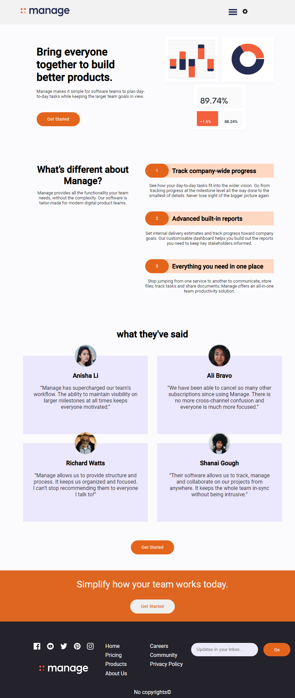
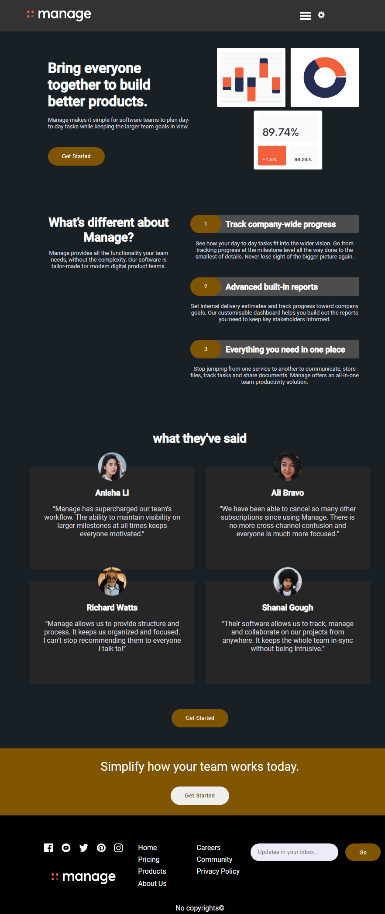
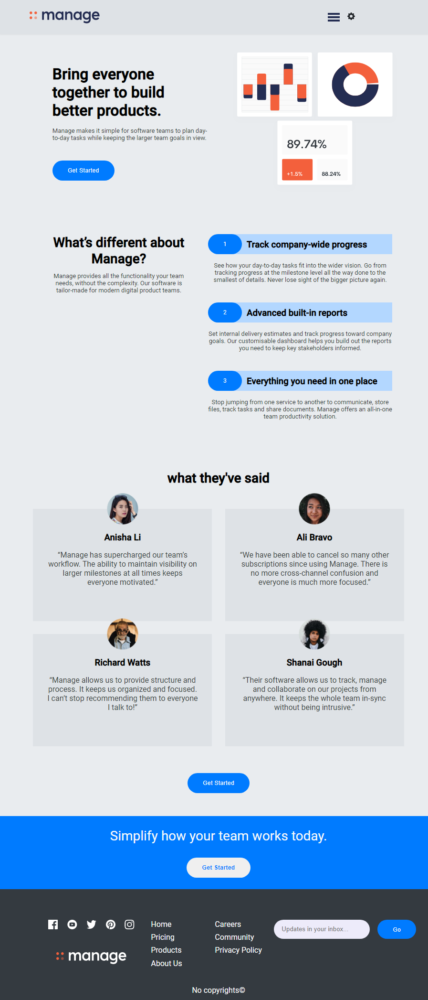
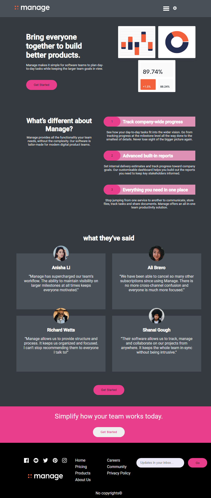
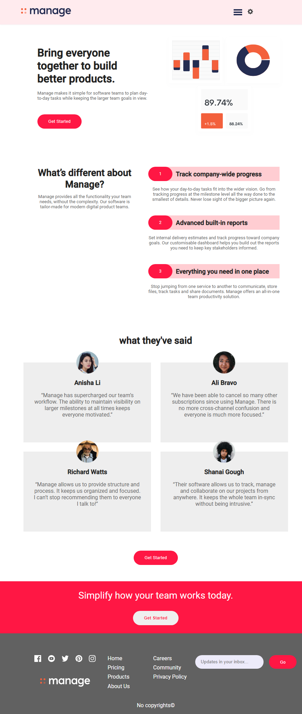
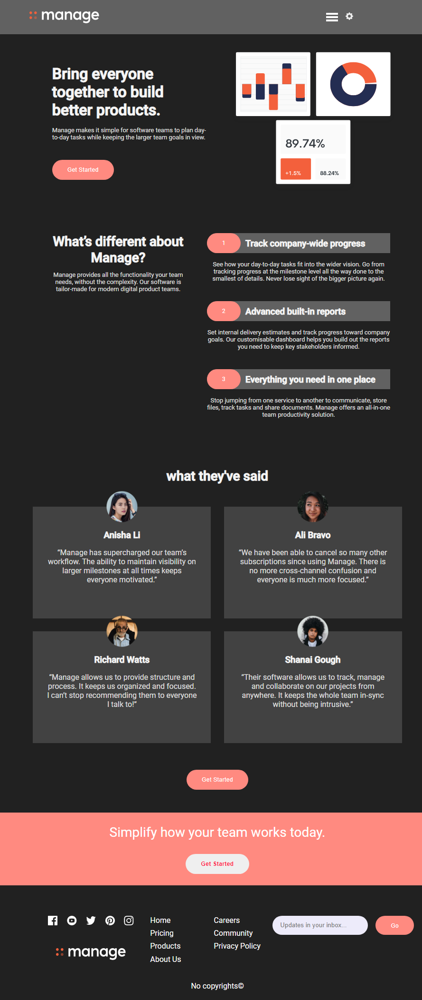

# Manage Landing Page With Various Themes
## TO Run Project

Run `ng serve` for a dev server. Navigate to `http://localhost:4200/`. The app will automatically reload if you change any of the source files.

# Screnshot of the web page with different Themes applied
## Custom Light Theme

## Custom Dark Theme

## Bootstrap Light Theme

## Bootstrap Dark Theme

## Material Light Theme

## Material Dark Theme
